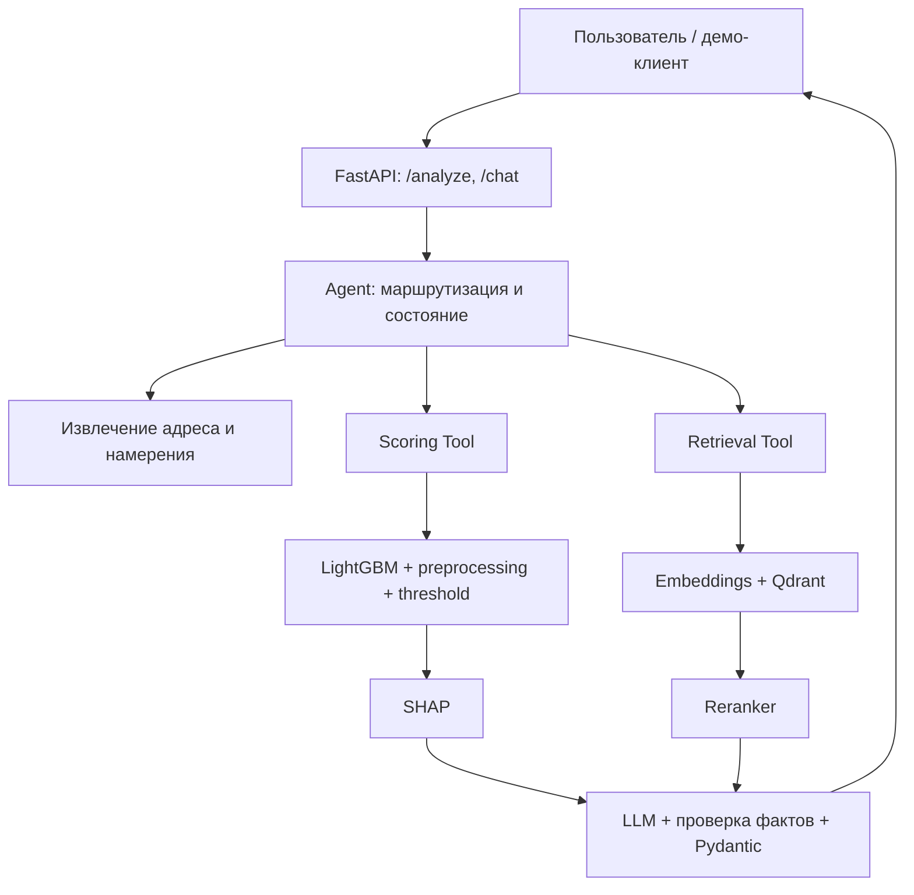

# Техническое задание: анализ риска криптокошельков — ML, RAG, Agent и production-процесс

**Версия:** 2.0, 26 сентября 2026 г.
**Назначение:** развитие существующего проекта скоринга в отдельный портфельный проект для практики ML production, RAG/LLM, развёртывания, CI/CD и мониторинга. Проект «NER + классификация/LLM» остаётся отдельным и не является предметом этого ТЗ.
**Рабочее название:** Wallet Risk Analyst. Название «AI Credit Analyst» использовать только после появления данных кредитных заявок и модели кредитного риска.

## 1. Что уже есть и что предстоит сделать

Существующий проект содержит LightGBM для риска криптокошельков, сохранённые модель, список признаков, заполнение пропусков и порог, Flask `/predict` и `/explain`, индивидуальный SHAP, файл топ-50 и диагностический мониторинг. Не переписывать этот слой с нуля. Перед работой Codex должен сверить эти утверждения с актуальным репозиторием и зафиксировать его состояние.

В предоставленном архиве `project_review.zip` порог **0,3578026090** выбран на validation по F1; сохранённые test ROC-AUC **0,8722954**, accuracy **0,8006693**, precision/recall/F1 класса 1 **0,7227 / 0,7342 / 0,7284**. Это показатели артефактов предоставленного запуска: без исходного набора данных в актуальном архиве они не воспроизведены заново. Показатели относятся к оценке строк наблюдений; не выдавать их за качество решения по целому кошельку или вероятность мошенничества в реальном мире.

Разделение train/validation/test выполнено по `wallet_address`; validation использовалась для подбора модели и порога, test — для отчёта. У адреса бывает несколько строк. Существующий топ-50 содержит 50 уникальных адресов, агрегированных как `max(row_probability)` с указанием строки максимума. Правило может быть смещено в пользу адресов с большим числом наблюдений; сравнить его с альтернативами и сохранить исходное правило как базовое. Старые JSON объяснений могут содержать прежний порог. Скрипт `simulate_labels.py` создаёт искусственные метки; они не подтверждают качество, а автоматическое переобучение не должно запускаться по одному сигналу дрейфа.

**Главный результат:** воспроизводимая система, которая получает входные признаки наблюдения и вопрос, считает скоринг и SHAP, находит *связанные* документы, формирует ответ со ссылками на источники, работает в контейнерах и на тестовом развёртывании, проходит CI и даёт наблюдаемые метрики. Готовый запуск и результаты проверок должны быть показаны, а не только описаны в README.

## 2. Схема системы

Отдельный эксплуатационный контур: **версионированные данные и артефакты → MLflow → тесты → Docker Compose → GitHub Actions → тестовое развёртывание → мониторинг → проверяемый откат**. Это поток управления версиями и поставкой, а не дополнительные источники риска для модели.

| Блок | Обязанность | Что выдаёт |
| --- | --- | --- |
| Data/ML | Воспроизводимое обучение, разбиение по адресам, сохранение preprocessing и порога | Версия модели, метрики строкового test, манифест данных |
| Scoring Tool | Вызов существующего скоринга с полными признаками | Оценка модели, класс, порог, версия, `request_id`, строка |
| SHAP Tool | Объяснение той же строки и версии модели | Факторы с направлением влияния; без причинных утверждений |
| NLP/Agent | Разбор запроса, разрешённые вызовы инструментов и ошибок | Адрес, intent, ход выполнения, статус достаточности данных |
| Document RAG | Проверка связи документа с адресом, поиск, повторное ранжирование | Фрагменты с `document_id`, `chunk_id` и происхождением |
| Answer/API | Сведение результатов и валидация структуры | Проверяемый ответ и явные ограничения |
| Operations | CI/CD, развёртывание, логи, метрики, версии и откат | Демонстрация жизненного цикла релиза |

## 3. Граница скоринга и воспроизводимость

1. Зафиксировать смысл **одной строки** и времени доступности каждого признака. Отдельно проверить признаки, которые могли образоваться *после* предполагаемого момента прогноза, и пересмотреть оценку при обнаружении утечки. Разделение по адресам само по себе не устраняет временную утечку.
2. `/predict` сейчас получает **признаки строки**, а не извлекает их по одному адресу. Без реализованного feature store запрос с одним адресом возвращает `insufficient_data`. Для демо допустим индекс заранее подготовленных наблюдений, но его источник, версия, доступность на момент прогноза и связь с адресом должны быть проверены; запрещено тайно подставлять строку из test.
3. Сохранять единый `model_version`: модель + порядок признаков + preprocessing + порог + код схемы. Каждое новое объяснение содержит `request_id`, `model_version`, адрес, версию схемы и идентификатор строки. Старое объяснение при несовпадении версии получает `stale` и не выдаётся за текущее. Не перезаписывать его по одному `user_id`.
4. Исправить предметную терминологию в `/explain`: «отказ/одобрение заявки» не соответствуют риску криптокошелька. Сохранить совместимость старого API там, где возможно; переходные поля документировать и проверять тестами. SHAP значения и текст должны относиться к тому же transformed input, классу и версии, что и оценка.
5. Для нескольких строк адреса явно возвращать оценки строк и правило агрегирования `max_row_probability`, `records_count`, `representative_row_id`. Исследовать влияние `records_count` на ранг и сравнить как минимум `max` с заранее зафиксированным альтернативным правилом на отдельном наборе. Не выдавать сохранённый топ-50 за живой рейтинг произвольного потока.
6. Сохранить воспроизводимый запуск: версия исходных данных/хеш, схема, commit, seed, список групп train/validation/test или их проверяемые хеши, версии зависимостей, параметры, метрики и артефакты. Для больших данных допустим DVC или манифест с внешним хранилищем; не коммитить приватный или громоздкий датасет в Git. Проверить пересечения адресов и временной горизонт.
7. MLflow Tracking журналирует запуск и артефакты, а Registry хранит версию модели; регистрировать **связанный пакет** с preprocessing и threshold и документировать выбор версии для inference. Если используется Registry, настроить подходящее постоянное backend-хранилище. Показать два запуска и контролируемый переход/возврат версии. Не менять продакшен-модель автоматически по одной метрике.

## 4. Документы для векторной базы

В текущем скоринге нет подтверждённого набора внешних расследований по кошелькам. Поэтому RAG строится как **честный демонстрационный корпус**, с происхождением каждого фрагмента:

- **Карточки наблюдений:** текст, детерминированно созданный из доступных исходных полей, с адресом, периодом/моментом среза, единицами измерения и ссылкой на исходные строки. Если поле или его смысл неизвестны, его не описывать. Такие карточки дублируют табличную модель и нужны прежде всего для проверки связи и поиска; не объявлять их независимым доказательством.
- **Синтетические заметки аналитика/кейсы:** отдельно сочинённые для демонстрации поиска и явно маркированные `synthetic_demo`. Например, заметка с наблюдением и гипотезой о сценарии, вопросами к проверке и связанным адресом. Не выдавать их за реальное расследование, жалобу, блокчейн-операцию или юридическое заключение.
- **Общие методические документы:** правила интерпретации скоринга, словарь признаков, ограничения модели, инструкции аналитику. Они не утверждают фактов о конкретном кошельке. При желании публичные источники добавлять отдельно с URL, датой получения, правами использования и проверенной связью; не сочинять происхождение.

Начать с небольшого воспроизводимого корпуса: например, 20–50 связанных адресов, 2–3 типа документов, несколько документов без связанного адреса и заведомо нерелевантные тексты. Генератор с seed создаёт версии файлов и manifest. Каждому документу нужны `document_id`, тип, `source_kind` (`derived_data` / `synthetic_demo` / `public_source`), `wallet_address` или явная таблица связей, `source_row_ids` при наличии, время среза, дата создания и `corpus_version`. Каждому фрагменту — `chunk_id`, смещение/страница, хеш текста, `embedding_version`, `index_version`. Тексты и манифест доступны для аудита и повторной индексации.

**Не помещать оценку LightGBM в карточку как «факт мошенничества».** Если нужна сохранённая оценка в демонстрационном отчёте, писать «оценка модели версии X на момент T», отдельно от свидетельств и с указанием исходного вызова. Число `predict_proba` не называть калиброванной вероятностью без проверки калибровки.

## 5. RAG, Agent и ответ

При известном адресе сначала выполнять **точную проверку и фильтр связи `wallet_address`**, а уже затем семантический поиск внутри допустимого набора документов. Семантическая похожесть не устанавливает принадлежность документа кошельку. Документы общего характера доступны через отдельный маршрут. Сравнить retrieval baseline (например, точная фильтрация + dense top-k) и вариант с reranker по размеченным парам «запрос — релевантный фрагмент». Измерять Recall@k и MRR или nDCG, а также ошибки чужого адреса. Если reranker не помогает, не включать его в основной путь только ради архитектурного списка.

Agent реализовать в этом же проекте на LangGraph: состояние запроса, узел разбора намерения (`score`, `explain`, `documents`, `combined`, `general`, `unsupported`), узлы разрешённых инструментов и сборки проверенного ответа. Scoring, SHAP и Retrieval оформить как инструменты LangChain (`@tool` или эквивалентный интерфейс для выбранных версий библиотек) с Pydantic-схемами аргументов/результатов, таймаутами и явными статусами ошибок. Граф должен выбирать нужные инструменты, ограничивать число шагов и обнаруживать повторяющиеся действия; простой вопрос не обязан запускать все инструменты. Детерминированную проверку адресов сделать отдельно от LLM. В этом проекте NLP-модуль служебный; подробное обучение и оценка самостоятельного NER относятся к проекту 1. Произвольное выполнение кода по запросу пользователя исключить.

Для LLM предусмотреть интерфейс провайдера: локальная модель работает в Ollama, LangGraph/LangChain подключаются к ней через локальный адрес сервиса. Они являются библиотеками оркестрации в том же Python-приложении, а не отдельным проектом или внешним облачным API. Зафиксировать версию модели/промпта и сценарий без доступного LLM. LLM не вычисляет score и SHAP. Ответ содержит `request_id`, адрес, статус данных, `model_version`, оценку и порог **с обозначением их природы**, факторы SHAP, отдельные `document_findings` со ссылками на существующие `document_id`/`chunk_id` и `source_kind`, `limitations`. Если документов нет, `sources=[]`; если признаков нет, `risk.status=insufficient_data`; если объяснение устарело, `risk.status=stale` с предложением пересчёта при наличии входа. При недоступной LLM вернуть структурированный результат инструментов без выдуманного анализа.

Валидировать структуру Pydantic, соответствие адреса и версии, существование цитируемого фрагмента и поддержку каждого документного утверждения текстом этого фрагмента. Инструкции внутри документов считать недоверенными данными. Не подменять вывод модели формулировкой «доказано мошенничество»; не выводить «кредит одобрен/отклонён».

## 6. API, контейнеры и релиз

FastAPI: `POST /analyze` для структурированного входа (признаки + адрес + вопрос), `POST /chat` для текста и доступного контекста, `GET /health/live`, `GET /health/ready`, `GET /version`. Отдельный ingestion CLI для корпуса; административный API лишь при явной потребности и с ограничением доступа. Существующий Flask сервис можно оставить отдельным за адаптером. JSON-контракты, коды ошибок, лимиты размера, таймауты и поведение при отказе Qdrant/LLM описать в OpenAPI/README.

Docker Compose поднимает API, скоринг, Qdrant и нужные локальные зависимости; Ollama может быть внешним сервисом, но README описывает полный локальный вариант и требования к ресурсам. Секреты, адреса сервисов и версии — через переменные окружения; `.env.example` без секретов. Данные Qdrant и MLflow в постоянных томах; миграция/повторная индексация версии корпуса — отдельная команда. Закрепить совместимые версии библиотек и образов.

GitHub Actions: на PR — lint/type checks, unit и contract/integration tests с заглушкой LLM, проверка корпуса, сборка контейнера; не переобучать модель и не запускать тяжёлую локальную LLM при каждом PR. После успешного CI — публикуемый образ с commit SHA, затем защищённая ручная поставка на отдельное тестовое окружение, smoke tests и фиксация версии. Показать реально выполненный тестовый deployment (локальная отдельная среда/сервер с доступными логами и адресом либо удалённый стенд); если удалённого стенда нет, честно обозначить локальный rehearsal и не утверждать наличие внешнего развёртывания. Откатить образ и модель/индекс к совместимым версиям, затем выполнить smoke test. Права на репозиторий, registry и сервер потребуются лишь на этапе фактической публикации; локальную часть подготовить заранее.

## 7. Мониторинг, проверки и критерии завершения

Логировать `request_id`, версии модели/индекса/промпта, intent, статусы инструментов, времена scoring/SHAP/retrieval/reranker/LLM, ошибки валидации и число найденных фрагментов. Метрики: доступность, latency (включая p95), доля ошибок, `insufficient_data`, отсутствие документов, невалидные ответы, доля документных утверждений с проверяемыми ссылками, распределение score и диагностический дрейф. Предусмотреть дашборд и хотя бы одно демонстрационное срабатывание оповещения. Не хранить секреты и полный текст документов в логах.

PSI считать по фиксированным бинам reference на общей шкале; отдельно контролировать крайние значения и пустые бины. Дрейф — повод расследовать, не доказательство деградации качества. Для качества модели нужны реальные проверенные метки с датой поступления, понятным происхождением и достаточным лагом; `synthetic_inverse_score` исключить. Автоматическое переобучение по PSI/синтетическим меткам не включать. Новую модель продвигать лишь после проверки данных, offline-оценки, сравнения с текущей и контролируемого решения.

**Приёмочные сценарии:** (1) валидные признаки и связанный документ → оценка, SHAP, подходящий фрагмент и проверяемый ответ; (2) один адрес без признаков → `insufficient_data`; (3) документ чужого адреса → не попадает в ответ; (4) старая версия JSON → `stale`; (5) недоступны Qdrant/LLM → частичный ответ с явным статусом; (6) prompt injection в документе → не меняет маршрутизацию; (7) несколько строк → правило агрегации и `records_count`; (8) откат версии → восстановлены совместимые артефакты.

Проверить на фиксированном наборе запросов, что Agent корректно распознаёт адрес кошелька, определяет тип запроса и вызывает нужные инструменты. Оценить поиск документов по заранее отмеченным релевантным фрагментам, проверить структуру ответов и точность ссылок на источники. Обязательны тесты, исключающие выдачу документов другого кошелька, а также проверки контрактов API, происхождения документов и обработки ошибок. Сохранять версии отчётов и результаты запусков. Метрики скоринга из раздела 1 не считать метриками качества RAG или Agent; полноценная оценка NER относится к отдельному проекту 1.

**Сдача:** актуальный репозиторий и README с командами чистого запуска; манифест модели и корпуса; MLflow runs и версия зарегистрированного пакета; фиксированный evaluation set и отчёты; работающий Docker Compose и smoke test; зелёный CI; подтверждённое тестовое развёртывание с адресом/логом или честно обозначенная локальная репетиция; дашборд/оповещение; протокол отката; короткий демонстрационный сценарий и ограничения. Это самостоятельно построенный production-like процесс, а не утверждение о корпоративной эксплуатации под реальной нагрузкой.

## 8. Последовательные команды для Codex

**Как использовать:** передать Codex это ТЗ и **только одну команду за раз**. После каждой команды потребовать список изменённых файлов, результаты тестов и текущие ограничения; переходить далее после работающего результата. Пути ниже относительны к корню актуального проекта. Если код расходится с ТЗ, сначала показать расхождение и адаптировать контракт, а не угадывать. Не добавлять компоненты последующих этапов заранее.

### Команда 1 — аудит исходного проекта

> Открой актуальный репозиторий и это ТЗ. Проверь `train_pipeline.py`, `app/api.py`, `src/data_preparation.py`, `src/evaluate.py`, `src/inference.py`, `monitoring/`, сохранённые модели и результаты. Создай `docs/baseline.md`: реальные входы/выходы, unit of prediction, split, подбор порога, версии артефактов, старые объяснения и предметные ошибки текста `/explain`. Укажи, есть ли источник признаков по адресу и датасет для повторного обучения. Выполни только безопасные проверки кода/контрактов и отчитайся; RAG и Agent пока не реализуй.

### Команда 2 — граница модели и данные

> По `docs/baseline.md` документируй смысл строки, время среза и доступность признаков; проверь потенциальную временную утечку и пересечение кошельков между split. Добавь воспроизводимый data manifest с хешем, схемой, seed и версиями зависимостей. Если данных нет, не выдумывай результаты и подготовь проверку, которую можно выполнить после подключения данных. Сохрани существующие test-артефакты и опиши ограничения метрик; напиши необходимые проверочные тесты.

### Команда 3 — версия и контракт скоринга

> Введи единый `model_version` для модели, признаков, preprocessing и порога. Добавь `request_id` и версию в прогноз и новый JSON объяснения, адрес и идентификатор строки держи отдельно от `user_id`. Обработай прежние JSON как `stale`, исключи перезапись прогноза по одному `user_id`. Исправь тексты про кредитное одобрение в `/explain`. Сохрани совместимость существующих клиентов настолько, насколько позволяет корректный контракт; покажи тесты `/predict`, `/explain`, несовпадающих версий и той же строки SHAP.

### Команда 4 — агрегация и источники признаков

> Реализуй scoring adapter с типизированными результатами для полной строки признаков, нескольких строк адреса и отсутствующих данных. Для одного адреса без источника признаков верни `insufficient_data`; не читай test как скрытый feature store. Для нескольких строк воспроизведи `max_row_probability`, верни `records_count` и строку максимума. Исследуй связь ранга с числом строк, сравни с одной явно определённой альтернативой на доступных данных; отчитайся о методе и ограничениях, не меняя базовое правило без решения.

### Команда 5 — MLflow и воспроизводимый запуск

> Подключи MLflow Tracking к существующему train pipeline: логируй параметры, метрики validation/test, версию данных, commit, feature schema, модель, preprocessing и threshold. Зарегистрируй совместимый пакет модели с постоянным backend-хранилищем и покажи два запуска и возврат к предыдущей версии. Если нет исходного датасета, подготовь код и конфигурацию, а демонстрацию честно пометь как ожидающую данные. Не переобучай на искусственных метках и не продвигай модель автоматически.

### Команда 6 — корпус документов

> Создай воспроизводимый небольшой демонстрационный корпус по разделу 4: карточки только из реально существующих полей, отдельно помеченные синтетические заметки и общие методические документы. Для каждого текста сохрани происхождение, адресную связь, время среза, версию корпуса и идентификаторы исходных строк, когда они есть. Если исходных строк нет, создай отдельно помеченный полностью синтетический fixture без заявлений о реальных операциях. Реализуй manifest, ingestion CLI, chunking и тесты связей/повторной генерации. Не превращай score в «факт мошенничества».
>
## Команда 6а — проверить разбиение документов

Проверь, сохраняет ли текущий chunking смысл документов: границы заголовков и абзацев, связь фрагмента с исходным документом и соседний контекст. Добавь тесты для случаев, когда значимый факт находится на границе двух фрагментов. Покажи примеры до и после; не меняй алгоритм, если проверка не выявила проблемы.

### Команда 7 — embeddings, Qdrant и reranker

> Проиндексируй корпус в Qdrant с `document_id`, `chunk_id`, `wallet_address`, `source_kind` и версиями. Для адресного вопроса фильтруй точную проверенную связь до семантического поиска; общий методический корпус ищи отдельно. Сделай baseline top-k, добавь reranker с переключателем, зафиксируй размеченные запросы и сравни Recall@k/MRR, ошибки чужого адреса и время. Покажи полную переиндексацию после изменения embedding model; пока не подключай LLM-генерацию.
>
## Команда 7а — сравнить варианты поиска

На том же фиксированном наборе запросов и релевантных chunk_id сравни: точный фильтр по wallet_address + векторный поиск; точный фильтр + BM25; объединение результатов BM25 и векторного поиска с удалением дублей; объединение + reranker. Для каждого варианта измерь Recall@k, MRR, ошибки выдачи документов чужого кошелька и время ответа. Фильтр адреса применяй до ранжирования во всех вариантах. Выбери основной вариант по результатам, а не по сложности архитектуры.

### Команда 8 — Agent, NLP и ответ

> Реализуй Agent на LangGraph в этом проекте: задай типизированное состояние и узлы разбора запроса, вызова инструментов и проверки ответа. Оформи существующие Scoring, SHAP и Retrieval как ограниченные инструменты LangChain (`@tool` или эквивалент для закреплённых версий), проверь аргументы и результаты через Pydantic; добавь таймаут, предел числа шагов и защиту от повторных вызовов. Подключи локальную LLM через Ollama по адресу сервиса из конфигурации, сохрани заменяемый provider; при её недоступности верни результат инструментов. Покажи в трассе запроса, что граф действительно выбирает и вызывает нужные инструменты, а не лишь проходит фиксированную цепочку с заглушками. Обосновывай документные утверждения существующим chunk ID, отделяй синтетический документ от данных и оценку модели от факта. Подготовь тесты выбора инструмента, проверки адреса, чужого документа, отсутствующих признаков, недоступных сервисов, лимита шагов и prompt injection. Отдельную обучаемую NER-модель здесь не создавай.
>
## Команда 8а — проверить составные вопросы и обоснованность ответов

Добавь тестовые вопросы, требующие нескольких сведений из разных фрагментов. Проверь, что Agent покрывает каждую часть вопроса или явно сообщает, каких данных нет. Для каждого утверждения о документе проверь не только существование chunk_id, но и то, что текст фрагмента действительно подтверждает утверждение. Ограничь число шагов Agent и предусмотрите частичный структурированный ответ при ошибке поиска или LLM. Покажи результаты тестов и примеры ошибочных ответов, которые проверки остановили.

### Команда 9 — FastAPI и локальный запуск

> Добавь FastAPI `/analyze`, `/chat`, `/health/live`, `/health/ready`, `/version` над Agent и совместимый scoring adapter. Подготовь Dockerfile, Compose, `.env.example`, постоянные тома, фиксированные зависимости и README чистого запуска. Запусти на чистой конфигурации с тестовым корпусом, проверь запрос с документом, без документа и без признаков. Сохрани старый Flask `/predict` и `/explain` и их контрактные тесты.

### Команда 10 — CI/CD и тестовое развёртывание

>Команда 10 — CI/CD и подготовка тестового развёртывания.

В этом шаге выполни только локальную подготовку.

Добавь GitHub Actions для PR:
- lint и type checks;
- unit/contract/integration tests с mock LLM;
- проверку корпуса;
- сборку Docker-образа без публикации и доступа к секретам.

Подготовь отдельный процесс публикации образа с тегом commit SHA и защищённый ручной deployment на отдельное тестовое окружение.
Секреты deployment должны поступать из GitHub Environment.
Предусмотри smoke tests после поставки.
Подготовь совместимый откат образа, модели и индекса:
зафиксируй их версии и способ восстановления предыдущего
совместимого набора, затем повторного smoke test.
Проверь файлы доступными локальными средствами и покажи dry run:
какие проверки реально выполнены, какие команды только показаны и что невозможно проверить без GitHub или сервера.
Текущий Docker-контейнер не останавливай без необходимости.
Ничего не устанавливай и не скачивай. Если чего-то не хватает,укажи это явно. Не выполняй push, публикацию образа или deployment
в этом шаге.
В конце дай короткий список ручных действий:
что настроить в GitHub, какой Environment создать,
какие секреты нужны и какие требования к тестовому серверу.
Доступ к отдельному тестовому серверу пока не предоставлен.
Удалённое развёртывание и реальный откат отметь как невыполненные.
Локальный dry run не называй удалённым релизом.

### Команда 11 — мониторинг и итоговая демонстрация

> Добавь структурированные логи, метрики latency/error/availability, версии и долю ответов с корректными источниками; сделай дашборд и тестовое оповещение. Проверь PSI на фиксированных reference bins, происхождение меток и отсутствие автоматического переобучения. Выполни все приёмочные сценарии раздела 7, сохрани отчёты с командами и результатами, снимки MLflow/CI/деплоя/отката и краткую демонстрацию для собеседования. Не представляй synthetic labels и синтетические документы как реальные данные.

## 9. Справка по выбранным компонентам

- [MLflow Tracking](https://mlflow.org/docs/latest/ml/tracking/) и [Model Registry](https://mlflow.org/docs/latest/model-registry/) — учёт экспериментов, происхождение и версии моделей.
- [Qdrant filtering](https://qdrant.tech/documentation/search/filtering/) — точные payload-фильтры при поиске.
- [GitHub Actions deployment environments](https://docs.github.com/en/actions/concepts/workflows-and-actions/deployment-environments) — управление поставкой и доступом к секретам.

Версии и конкретные API этих компонентов проверить при реализации и зафиксировать в проекте.
